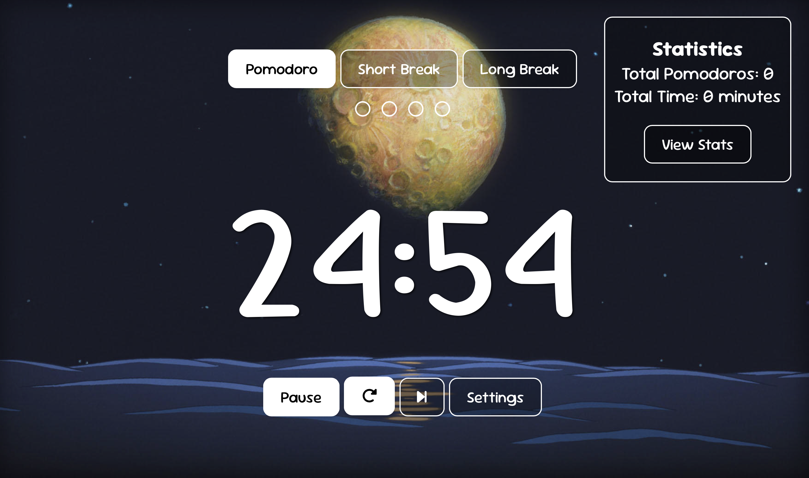

# Studio Ghibli Pomodoro App ⏳✨

A **Studio Ghibli–themed productivity timer** that combines the Pomodoro technique with immersive visuals and session tracking. Designed for focus, balance, and a little bit of magic.


### Focus Timer

---

## Tech Stack 💻
- **Frontend:** HTML, CSS, JavaScript (responsive, interactive UI)
- **Backend:** Flask + SQLite (REST API for sessions and stats)
- **Deployment:** GitHub Pages (frontend) + Render (backend)

---

## Features 🚀
- 🕒 Focus, Short Break, and Long Break modes
- 🎨 Choose from multiple Studio Ghibli backgrounds
- ⏱️ Adjustable session durations
- 🔁 Reset and ⏭️ Skip controls
- 📊 Stats dashboard: track total focus time and completed sessions
- 💾 Persistent storage with localStorage + database
- 🌙 Clean, minimal design with an aesthetic vibe

---

## API Endpoints 🌐
- `GET /api/health` → check backend status
- `POST /api/sessions` → save a completed session
- `GET /api/stats` → retrieve total focus time + number of sessions

---

## Getting Started 🛠️
1. Clone the repo.
2. Install backend dependencies:
```bash
pip install -r requirements.txt
```
3. Run the Flask server:
``` bash
flask run
```
4. Open the frontend (`index.html`) in your browser.

---

## Credits 🎬
- Visual assets inspired by **Studio Ghibli** films.
- Built as a personal learning project and portfolio piece.